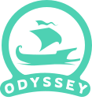

<div align="center">
    <h1>
      
    </h1>
    
    &nbsp;
    
    &nbsp;
    
	<br/>
	<a href="LICENSE"></a>
	&nbsp;
  	<a href="https://discord.gg/Q87RpK8Drw"></a>
</div>

## Descrição
Odysseus é o backend do projeto Odyssey, da Escola Sistêmica. Construído com [Nest](https://nestjs.com/), possuí uma forte padronização e uso de tecnologias modernas.

[Discord](https://discord.gg/vk9jFUFh)

[Wiki do Projeto](https://github.com/FaculdadeSenaiJoinville/pes-back/wiki)

```bash
git clone https://github.com/FaculdadeSenaiJoinville/odysseus.git
```
